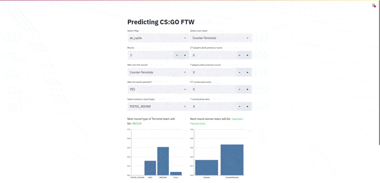
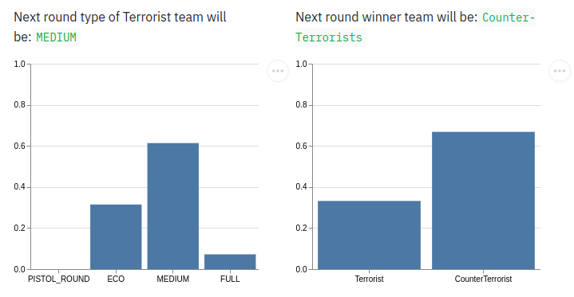

# Predicting CS:GO FTW Web App

<br>

**Victor Lucia**

**Ironhack Madrid 2020 Part-time**

**[Link to Web App](https://predicting-csgo-app.herokuapp.com/)**
##

<br>

The objective of the project is to **predict relevant information** on the fly of ranked matches in the competitive video-game Counter-Strike: Global Offensive (CS:GO), played daily by more than 800.000 players worldwide. With this information the teams can anticipate and coordinate for the next round, creating good strategies either defense or attack, depending on the side they are playing:
- Counter Terrorist (CT): Defense
- Terrorist (T): Attack

Counter-Strike: Global Offensive forms part of the eSports, a growing market that is living his golden years with followers all over the world and moving big amounts of money. Only in tournament prizes, [CS:GO has passed $100M](https://esportsobserver.com/csgo-passes-100m-totalprize-money/)  from his beginning.


## :computer: Webb App

This is the Web App of my final project made for the Data Analytics Bootcamp at Ironhack.

You can find the core of the project in my repo [Predicting_CSGO_FTW](https://github.com/Laserdan/Predicting_CSGO_FTW)

This repo is used to load the predicting models, and deploy the app to make it available for everybody.


##  :nut_and_bolt: Workflow


From the machine learning predictive models made in the [previous repo](https://github.com/Laserdan/Predicting_CSGO_FTW), we load them to make 2 predictions:
- Probability of the next round type for the enemy team.
- Probability of each team to be the winner of the round.

Thanks to the [streamlit library](https://www.streamlit.io/), we create a dashboard for the input of the data and the output of the predictions.
The player fills the required fields to give the ingest data to the models and them print down the predictions.

To be accesible 24/7 to everybody, the app is hosted in [Heroku](https://www.heroku.com/)


## :mag: How to

The player should fill the fields accordingly with the description:

- <code>Select Map</code>: Select the name of the map where the match takes part.
- <code>Select your team</code>: Select the side the player will be playing: Counter-Terrorist or Terrorist.
- <code>Round</code>: Select the current round the player is playing.
- <code>Who win the round?</code>: Select the team who win the previous round: Counter-Terrorist or Terrorist.
- <code>Was the bomb planted?</code>: Select YES or NOT accordingly if the bomb was planted in the previous round.
- <code>Select enemy's round type</code>: Select from the menu what type of round you consider the enemy team did the previous round. Possibilities: PISTOL_ROUND, ECO, MEDIUM, FULL.
- <code>CT players alive previous round</code>: The number of players from the CT side that remain alive at the end of the previous round.
- <code>T players alive previous round</code>: The number of players from the T side that remain alive at the end of the previous round.
- <code>CT consecutive wins</code>: The number of rounds that the CT side is consecutive winning counting the last round.
- <code>T consecutive wins</code>: The number of rounds that the T side is consecutive winning counting the last round.



## :printer: Output

**Left side:** Prediction for the next round type for the enemy team and the probabilities for each type of round.

**Right side:** Prediction for the winning team of the current round and the probability of each team.



## :computer: Requirements 

| Technology | Version | Documentation | 
| --- | --- | --- |
| Python | 3.7.3 | [www.python.org](https://www.python.org/doc/) |
| Pandas | 1.1.3 | [pandas.pydata.org](https://pandas.pydata.org/docs/reference/index.html) |
| Streamlit | 0.71.0 | [streamlit.io](https://docs.streamlit.io/en/stable/) |
| Scikit-Learn | 0.23.1 | [scikit-learn.org](https://scikit-learn.org/stable/user_guide.html) |
| LightGBM | 2.3.0 | [lightgbm.readthedocs.io](https://lightgbm.readthedocs.io/en/latest/index.html) |
| Joblib | 0.15.1 | [joblib.readthedocs.io](https://joblib.readthedocs.io/en/latest/) |
| Altair | 4.1.0 | [altair-viz.github.io](https://altair-viz.github.io/) |

## :file_folder: Folder structure
```
└── project
    ├── .gitignore
    ├── Procfile
    ├── README.md
    ├── myapp.py
    ├── myapp_recover.py
    ├── requirements.txt
    ├── runtime.txt
    ├── setup.sh
    ├── assets/
    └── models
        ├── db_ct_nxt_rnd_type.joblib
        ├── db_ct_winner_team.joblib
        ├── db_t_nxt_rnd_type.joblib
        └── db_t_winner_team.joblib

```


### :love_letter: Contact info
Mail: victorluciajimenez@gmail.com

LinkedIn: [VictorLucia](https://www.linkedin.com/in/victor-lucia/)

Getting help, getting involved, hire me please.

